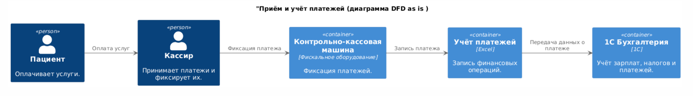
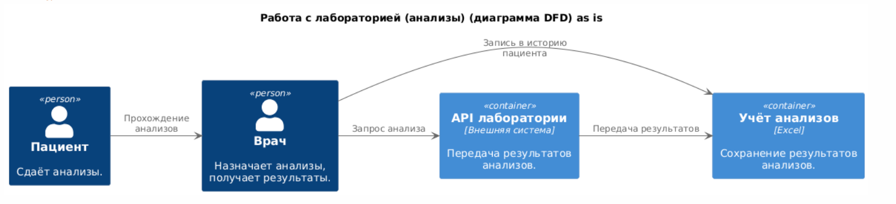
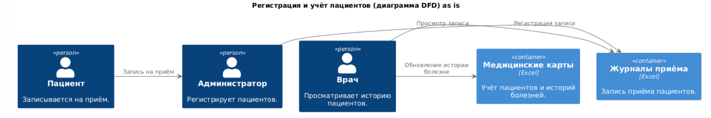
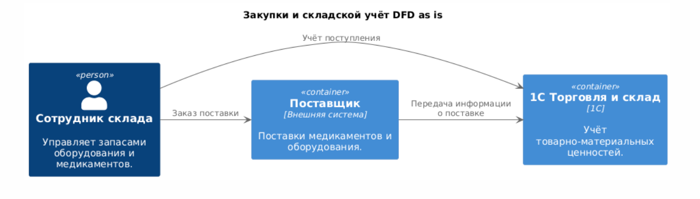
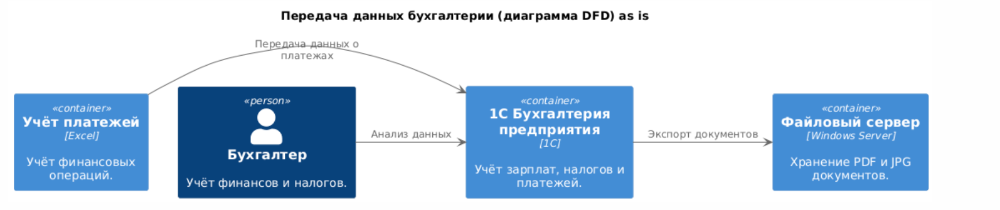

# Решение задачи 1

# 1. Основные потоки данных для компании «Медикаменте»

Вот основные потоки данных для компании «Медикаменте» с учетом критичных процессов.  
Я создам диаграммы потоков данных (DFD) в формате PlantUML (C4-диаграммы) для следующих процессов:

1. **Приём и учёт платежей**
2. **Работа с лабораторией (анализы)**
3. **Регистрация и учёт пациентов**
4. **Закупки и складской учёт** (новый процесс)
5. **Передача данных бухгалтерии** (новый процесс)

## 1.1. Приём и учёт платежей (диаграмма DFD)

## 1.2. Работа с лабораторией (анализы) (диаграмма DFD)

## 1.3. Регистрация и учёт пациентов (диаграмма DFD)

## 1.4. Закупки и складской учёт (диаграмма DFD)

## 1.5. Передача данных бухгалтерии (диаграмма DFD)

# 2. Улучшение безопасности данных в компании «Медикаменте» - предложения по улучшению и защите данных

## Введение
Этот раздел документа содержит основные меры по повышению безопасности обработки персональных и медицинских данных в компании «Медикаменте». Реализация данных мер позволит соответствовать принципам **Privacy by Design, Data Minimization, Data Lineage**, а также требованиям законодательства (например, **ФЗ-152 «О персональных данных»**).

---

## 2.1. Централизованное хранение данных
### Проблема:
Все данные хранятся в разрозненных файлах Excel и PDF/JPG, что приводит к рискам утечек и несанкционированного доступа.

### Решение:
- Внедрение централизованной **медицинской информационной системы (МИС)**.
- Использование **базы данных (PostgreSQL/MySQL)** вместо Excel.
- Перейти на **единую систему учёта (CRM, ERP или новая база данных)**, чтобы исключить дублирование в Excel.
- Автоматизировать **интеграцию с 1С** (кассиры не вводят данные вручную).

---

## 2.2. Контроль доступа и аудит
### Проблема:
Нет разграничения доступа, все сотрудники потенциально могут видеть все данные.

### Решение:
- Внедрить **ролевую модель доступа (RBAC)** или **атрибутивную (ABAC)**.
- Ограничить доступ к медицинским данным только **уполномоченным сотрудникам** (принцип наименьших привилегий).
- Внедрить **журналирование всех действий (Audit Trail)** для отслеживания доступа.
- Подключить **SIEM-систему** (например, **ELK Stack**) для мониторинга и анализа подозрительных активностей.

---

## 2.3. Шифрование и анонимизация данных
### Проблема:
Данные хранятся и передаются в открытом виде.

### Решение:
- Включить **шифрование хранимых данных (AES-256)** и **передаваемых данных (TLS)**.
- Использовать **шифрование на уровне дисков** (BitLocker, LUKS) для серверов с конфиденциальными данными.
- Реализовать **анонимизацию персональных данных** (BI/аналитика не получает ФИО).
- При работе с базами данных использовать **TDE (Transparent Data Encryption)**.

---

## 2.4. Классификация и тегирование данных
### Проблема:
Все данные хранятся без разбора, что усложняет защиту.

### Решение:
- Разделить данные на категории: **«Конфиденциальные (медицинские)», «Персональные (PII)», «Внутренние», «Публичные»**.
- Использовать **DLP-системы и классификаторы** (Microsoft Purview, Varonis) для автоматического выявления и маркировки данных.
- Настроить политики хранения: **медицинские данные шифруются и доступны только врачам**.

---

## 2.5. Data Minimization и политика удаления данных
### Проблема:
Данные хранятся без контроля и удаляются вручную.

### Решение:
- Хранить **только необходимые данные** (не собирать лишнюю информацию).
- Внедрить **автоматизированный механизм поиска и удаления данных** по запросу пациента (ФЗ-152).
- Настроить **сроки хранения (retention policy)**, например, удаление анализов через X лет.

---

## 2.6. Безопасность интеграции с лабораториями и внешними сервисами
### Проблема:
Передача данных в лаборатории и от них не контролируется.

### Решение:
- Перейти на **защищённый REST API (HTTPS + OAuth 2.0, JWT)** вместо отправки данных по email.
- Ограничить объём и тип передаваемых данных (только необходимые показатели анализов).
- Логировать **каждую передачу данных** (кто инициировал, какие данные переданы, когда).

---

## 2.7. Контроль пересылки данных наружу (DLP)
### Проблема:
Нет защиты от утечек через почту, мессенджеры, флешки.

### Решение:
- Внедрить **DLP-систему** для контроля утечек (электронная почта, мессенджеры, USB).
- Настроить **оповещения о подозрительных действиях**, например, массовое копирование файлов.

---

## 2.8. Резервное копирование и отказоустойчивость
### Проблема:
Отсутствие резервных копий может привести к потере данных.

### Решение:
- Настроить **автоматизированные резервные копии (ежедневно)**.
- Использовать **отказоустойчивое хранилище (S3-совместимое облако)**.

---

## 2.9. Обучение персонала и организационные меры
### Проблема:
Сотрудники не обучены защите данных.

### Решение:
- Разработать **регламенты по работе с конфиденциальной информацией**.
- Провести **обучение сотрудников** по вопросам информационной безопасности.
- Внедрить **процедуру быстрого отзыва доступа** при увольнении или смене должности.

---

## **Вывод**
Реализация данных мер позволит компании «Медикаменте»:
✅ **Соответствовать законодательным требованиям** (ФЗ-152).  
✅ **Минимизировать риски утечек данных** и предотвратить инциденты.  
✅ **Сделать IT-инфраструктуру безопасной и отказоустойчивой**.

Эти меры помогут избежать репутационных потерь и финансовых санкций при возможных инцидентах. 🚀

# 3. Аудит безопасности компании «Медикаменте» - Список проблемных зон

## Введение
Этот раздел документа содержит анализ основных проблем безопасности данных в компании **«Медикаменте»**, а также рекомендации по их устранению. Реализация предложенных мер позволит повысить защищённость персональных и медицинских данных и соответствовать требованиям **ФЗ-152** и принципам **Privacy by Design**.

---

## 3.1. Отсутствие централизованного хранения данных
### Риски:
- Разрозненные файлы **Excel** и **PDF** могут быть легко скопированы или утеряны.
- Нет контроля версий данных, возможны **ошибки и дублирование информации**.
- Данные пациентов хранятся в файлах **без разграничения доступа**.

### Рекомендации:
- Внедрение **медицинской информационной системы (МИС)** вместо Excel.
- Использование **централизованной базы данных** с управлением доступом.
- Настроить **правила доступа** (врач видит мед. карты, кассир только платежи).

---

## 3.2. Неконтролируемый доступ к файлам
### Риски:
- **Все сотрудники** имеют доступ к общим папкам и файлам Excel, содержащим **медицинские и персональные данные**.
- **Нет разграничения доступа по ролям (RBAC/ABAC)**.
- Отсутствует **логирование действий** сотрудников.

### Рекомендации:
- Внедрить **ролевую (RBAC) или атрибутивную (ABAC) модель доступа**.
- Разграничить права: **врачи, ресепшен, кассиры, бухгалтерия**.
- Включить **журналирование всех действий** с конфиденциальными данными.

---

## 3.3. Неавторизованный доступ к платежным данным
### Риски:
- Excel-файлы с платёжными данными могут быть **изменены вручную**.
- Отсутствует **автоматизированный механизм сверки платежей**.
- Данные пересылаются через **незащищённые каналы**.

### Рекомендации:
- Полный отказ от **Excel** в учёте платежей.
- Интеграция **1С Бухгалтерия** и **CRM** для автоматического учёта.
- Включить **журналирование** операций и сверку транзакций.

---

## 3.4. Отсутствие шифрования данных
### Риски:
- Конфиденциальные данные пациентов хранятся в **открытом виде**.
- Передача данных по сети **без шифрования**.
- Файлы PDF/Excel с медицинскими данными могут **утечь**.

### Рекомендации:
- Включить **шифрование данных в хранилищах (AES-256)**.
- Использовать **TLS/HTTPS/VPN** для передачи данных.
- Настроить **BitLocker (или аналог) для серверов** с конфиденциальными данными.

---

## 3.5. Ненадёжное резервное копирование
### Риски:
- Данные могут быть **потеряны при сбое оборудования**.
- Отсутствует **стратегия восстановления данных**.

### Рекомендации:
- Настроить **автоматизированные резервные копии** (ежедневно).
- Использовать **отказоустойчивые хранилища (S3-совместимое облако)**.
- Внедрить **процедуру тестового восстановления данных**.

---

## 3.6. Уязвимость почтовой системы
### Риски:
- **Пересылка данных** через обычную почту (без шифрования).
- Возможны **фишинговые атаки** на сотрудников.

### Рекомендации:
- Настроить **шифрование почты (PGP, S/MIME)**.
- Запретить отправку **медицинских данных через email**.
- Внедрить **DLP-систему** для контроля утечек.

---

## 3.7. Отсутствие классификации (тегирования) данных
### Риски:
- Нет **разделения данных** на уровни доступа.
- Любой сотрудник может открыть **PII, медицинские данные, финансовую информацию**.

### Рекомендации:
- Разделить данные на категории: **«Конфиденциальные», «Ограниченные», «Внутренние», «Публичные»**.
- Внедрить **DLP и классификаторы** (например, Microsoft Purview).
- Автоматизировать **маркировку документов**.

---

## 3.8. Двойной учёт (Excel и 1С)
### Риски:
- Сотрудники **дублируют данные в Excel и 1С**, что приводит к ошибкам.
- Повышается риск **расхождений в данных**.

### Рекомендации:
- **Отказаться от Excel** в платёжных и медицинских процессах.
- Настроить **автоматическую интеграцию 1С и CRM**.

---

## 3.9. Нет политики удаления и обезличивания данных
### Риски:
- Старые данные **не удаляются**, даже если пациент покинул клинику.
- Нет механизма **анонимизации данных**.

### Рекомендации:
- Настроить **сроки хранения (retention policy)**.
- Внедрить **автоматическое обезличивание/удаление**.

---

## 3.10. Отсутствие контроля за отправкой данных наружу
### Риски:
- Сотрудники могут пересылать **Excel/PDF с пациентами** через личную почту.
- Отсутствует **DLP-система**, контролирующая утечки.

### Рекомендации:
- Внедрить **DLP-систему (Data Loss Prevention)**.
- Настроить **блокировку несанкционированных отправок данных**.

---

## 3.11. Уязвимости в ручном процессе работы с лабораторией
### Риски:
- **Результаты анализов** пересылаются **по email в открытом виде**.
- Возможна **утечка данных** при неправильной отправке.

### Рекомендации:
- Перейти на **защищённый REST API (OAuth 2.0, JWT)**.
- Логировать **все запросы и ответы лаборатории**.

---

## **Вывод**
Реализация данных мер позволит:
✅ **Соответствовать требованиям ФЗ-152**.  
✅ **Защитить данные пациентов и предотвратить утечки**.  
✅ **Автоматизировать процессы и повысить отказоустойчивость**.

Эти меры помогут компании **избежать штрафов, репутационных потерь** и повысить уровень доверия клиентов. 🚀

