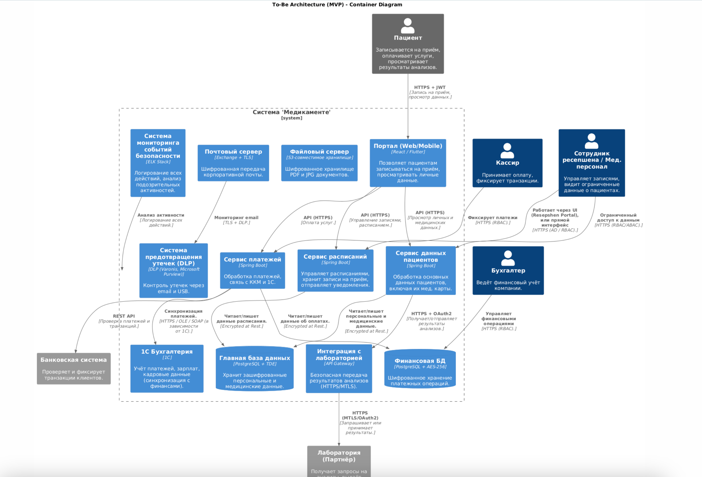

# # Решение задачи 2. Решение To-Be для MVP: Безопасная обработка данных в «Медикаменте»

## Введение
В рамках решения **To-Be** для компании **«Медикаменте»** предлагается **новая архитектура системы**, которая устранит выявленные проблемы в безопасности данных, автоматизирует процессы и обеспечит соответствие требованиям **ФЗ-152**, а также лучшим практикам безопасности (**Privacy by Design, Data Minimization, Data Lineage**).

Основные цели:
- Централизованное **и безопасное хранение данных**.
- Разграничение **доступа по ролям** (RBAC, ABAC).
- **Шифрование** (TLS, AES-256, TDE) данных при хранении и передаче.
- **Аудит всех действий** и защита от несанкционированного доступа.
- **Автоматизация обработки данных** и интеграция с лабораториями.

---

## 1. Централизованное хранение данных
### Проблема:
- Данные пациентов хранились в **разрозненных Excel-файлах** и могли быть утеряны или изменены.
- Нет единой системы управления медицинскими картами и платёжной информацией.

### Решение:
✅ Внедрение **медицинской информационной системы (МИС)** на базе веб-сервиса.  
✅ Использование **централизованных баз данных**:
- **PostgreSQL с Transparent Data Encryption (TDE)** для хранения пациентов и платежей.
- **S3-хранилище** для результатов анализов и сканов.  
  ✅ Полный **отказ от Excel** в операционной деятельности.

---

## 2. Контроль доступа и аудит
### Проблема:
- Нет разделения доступа: сотрудники могли видеть **непредназначенные для них данные**.
- Отсутствует **логирование и аудит** действий пользователей.

### Решение:
✅ Внедрение **ролевой модели доступа (RBAC)** и атрибутивного контроля (ABAC).  
✅ Ограничение доступа к медицинским данным **только врачам**.  
✅ Полное **журналирование** всех операций (кто, когда, какие данные просматривал).  
✅ Подключение **SIEM-системы** для анализа подозрительных активностей.

---

## 3. Шифрование и защита данных
### Проблема:
- Данные хранятся **в открытом виде**, передаются по незащищённым каналам.

### Решение:
✅ Включение **AES-256** для хранения медицинских и финансовых данных.  
✅ Использование **TLS 1.3 + VPN** для передачи данных между сервисами.  
✅ Реализация **BitLocker (или LUKS)** для защиты серверов хранения.  
✅ Внедрение **TDE (Transparent Data Encryption)** для шифрования базы данных.

---

## 4. Политики хранения и удаления данных
### Проблема:
- Отсутствовали **механизмы автоматического удаления или обезличивания данных**.

### Решение:
✅ Внедрение **Retention Policy** – автоматическое удаление старых данных.  
✅ Включение **автоматического обезличивания данных пациентов** по запросу.  
✅ Настройка **механизма удаления** при завершении срока хранения.

---

## 5. Интеграция с лабораториями через API
### Проблема:
- Лабораторные анализы пересылались **по email**, либо в бумажном виде.

### Решение:
✅ Подключение **защищённого REST API** для автоматического получения анализов.  
✅ Использование **OAuth 2.0 + JWT-токены** для защиты API.  
✅ Логирование всех операций передачи данных лабораториям.

---

## 6. Финансовый контроль и автоматизация платежей
### Проблема:
- Кассиры вносили платежи вручную **и дублировали в Excel и 1С**.
- Возможность **изменения платёжных данных вручную**.

### Решение:
✅ Интеграция **Системы платежей (Payment System) с 1С Бухгалтерией**.  
✅ Полный **отказ от Excel** для платёжных операций.  
✅ Настройка **автоматической сверки платежей** с банком.

---

## 7. Контроль пересылки данных (DLP)
### Проблема:
- Сотрудники могли **пересылать Excel-файлы с данными пациентов** через email.

### Решение:
✅ Внедрение **DLP-системы (Data Loss Prevention)** для контроля утечек.  
✅ Запрет **отправки данных пациентов через личную почту**.  
✅ Настройка **автоматических оповещений** о попытках утечки.

---

## 8. Автоматизированное резервное копирование
### Проблема:
- Не было **стратегии резервного копирования**, данные могли быть утеряны.

### Решение:
✅ Внедрение **автоматизированного резервного копирования (S3, NAS)**.  
✅ Создание **плана аварийного восстановления (Disaster Recovery Plan)**.

---

## 9. Обучение персонала и организационные меры
### Проблема:
- Сотрудники **не обучены** работе с конфиденциальной информацией.

### Решение:
✅ Разработка **регламентов и политик по защите данных**.  
✅ Проведение **тренингов и обучения персонала** по ИБ.  
✅ Внедрение **процедуры быстрого отзыва доступов** при увольнении.

---

# **Вывод**
### 📌 Внедрение данного решения **To-Be** позволит:
✅ Полностью **защитить данные пациентов** от несанкционированного доступа.  
✅ Исключить **разрозненное хранение** в Excel и PDF-файлах.  
✅ Перейти на **централизованное хранение** с контролем доступа.  
✅ Обеспечить **законодательное соответствие ФЗ-152**.  
✅ Минимизировать риски утечек, финансовых потерь и репутационного ущерба.

Таким образом, компания **«Медикаменте»** получит **безопасную и отказоустойчивую архитектуру**, отвечающую всем современным требованиям к обработке медицинских данных. 🚀

Диаграмма контейнеров (в нотации C4 ниже):

